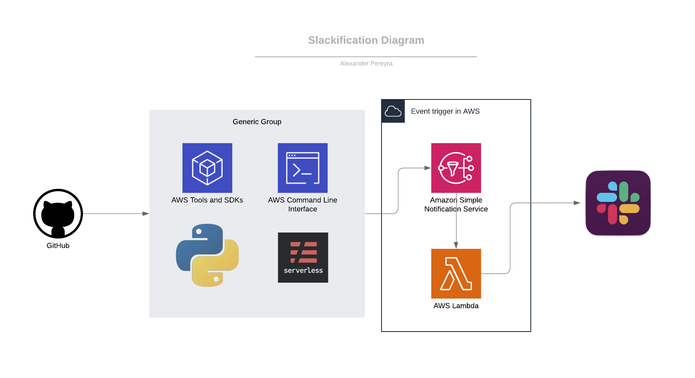

# slackifications

How to get sns topics sent to slack. You can reuse this to get any notifications from any other service you would like to receive notifications for. Cloudwatch for example.



## prereqs

- awscli configured with profile
- python3
- requests python package for use of http programmatically
- boto3
- node
- serverless
- ssh access to private

## project setup

- clone this repo
```
git clone https://github.com/alexpereyra/slackifications.git
```

- cd into cloned repo and create directory
```
cd slackifications
mkdir slackifications
cd slackifications
```

- Go to your slack workspace and create or use and existing slack channel.

- Create a slack app 'customize slack' > 'configure apps' > 'build' > 'create an app' and connect it to the workspace.

- Now create the 'incoming webhook' for the app and 'turn on'. Select 'add new webhook to workspace' and associate to channel previously created and 'authorize'.

- Test hook by copying and pasting the sample curl request provided.

- Copy newly created 'webhook url'

- serverless project setup (shortform of command included. pick one. they do the same thing.) This creates 2 files named 'handler.py' (this will be the lambda code) and a 'serverless.yml' (this is the serverframe work that will doing the leg work for your deployments...such as the creation and updating of cloudformation templates for the project).
more info can be found at https://serverless.com/
```
serverless create --template aws-python3 --name slackifications
```
OR
```
sls create -t aws-python3 -n -slackifications
```
- overwrite contents of the newly created 'handler.py' and 'serverless.yml' with contents from this repo.

- Copy the arn of an existing topic or create one. Paste into 'serverless.yml' file under functions > post_to_slack > events > sns

- Copy 'requirements.txt' and 'setup.cfg' into 'slackifications' directory created for serverless project.
  - Note that the 'setup.cfg' file is due to how serverless interacts with version of pip installed via brew.

- install python requirements using plugin for serverless (this will append your 'serverless.yml file with the necessary plugin') and handles the python dependencies.
```
sls plugin install -n serverless-python-requirements
```

- make a copy of the 'config.tmpl.json' and name it 'config.dev.json'. This is used to provide environment variables to the lambda function.

- deploy (this will deploy the lambda code using the serverless framework. You can go into your aws account and see the lambda function that is created which will be named 'slackification-environment' note that environment will default to dev)
```
sls deploy
```

- invoke function from the command line to test!
```
sls invoke -f slackifications
```

- You can test your sns topic using the aws command below which requires you have the message in a text file. More info can be found here https://docs.aws.amazon.com/cli/latest/reference/sns/publish.html
```
aws sns publish --topic-arn <ARN_OF_TOPIC> --message file://message.txt
```
- check logs
```
sls logs -f slackifications
```
